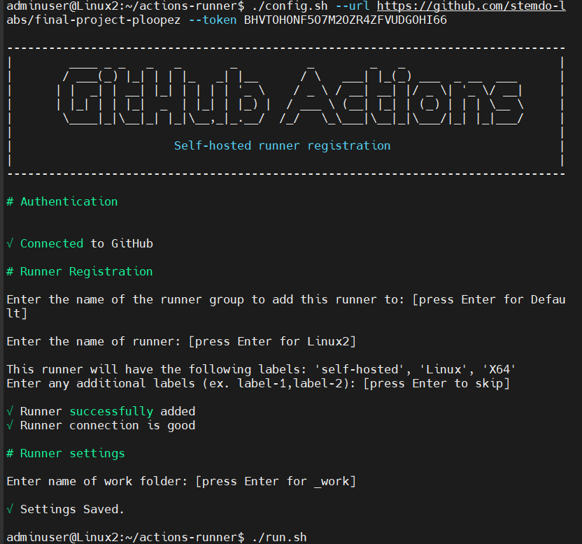
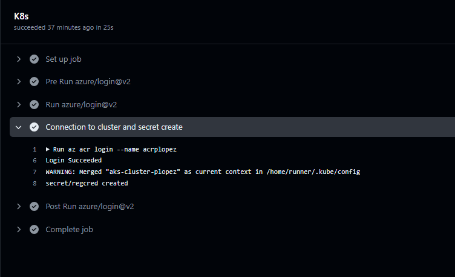
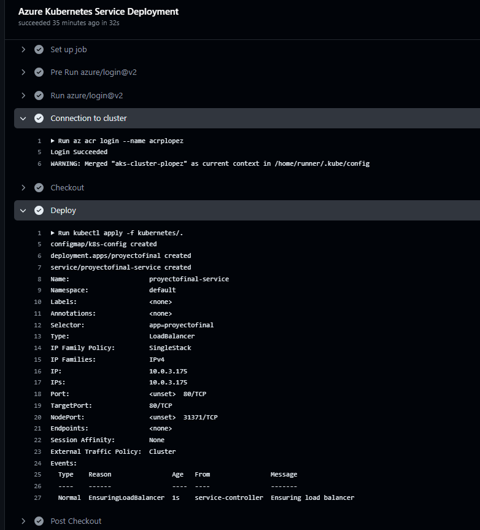
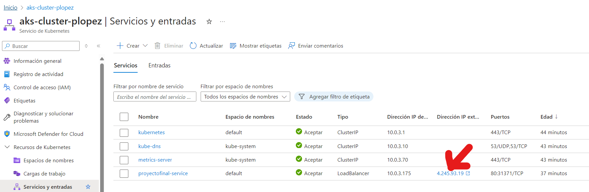
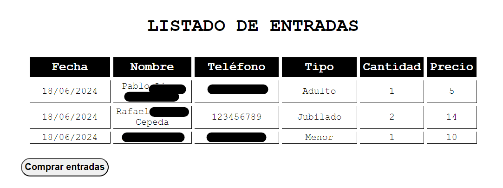
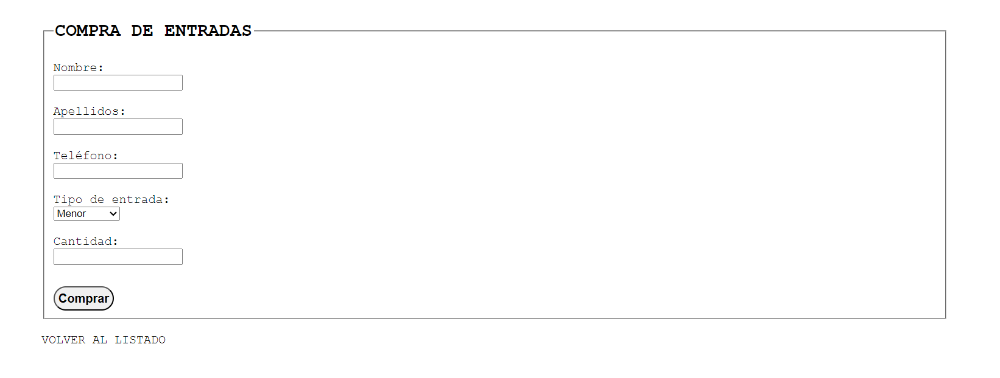

# final-project-ploopez

Pasos para la puesta en ejecución del proyecto
1. Desplegar Terraform Completo 

                

2. Una vez desplegado terraform, creamos el self hosted runner en la máquina virtual 2

                

3. Ejecutar el workflow de ansible utilizando el self hosted runner creado en el paso anterior 

                

4. Posteriormente, copiamos laa password generada por el ACR y se pega en la variable correspondiente dentro del environment
5. Ejecutamos el Workflow del ACR get credentials y el kubectl generate secret para que el cluster pueda conectaarse al ACR

                

6. Subimos la imagen de nuestra Aplicación PHP al ACR 
7. Ejecutamos el kubectl apply de los deployments, services, configmaps que sean requeridos 

                

8. Obtenemos la IP del Load Balancer que nos permitirá conectarnos al cluster y, por consiguiente,a la aplicación

                

9. Acceder a la IP y Realizar la compra de entradas.

                

                

* Funcionalidades a parte de la ejecución normal del proyecto * 

    - Copias de seguridad diarias 
    - Plan de recuperación de los datos en caso de fallo o desastre
    - Destrucción del entorno automatizada
    

